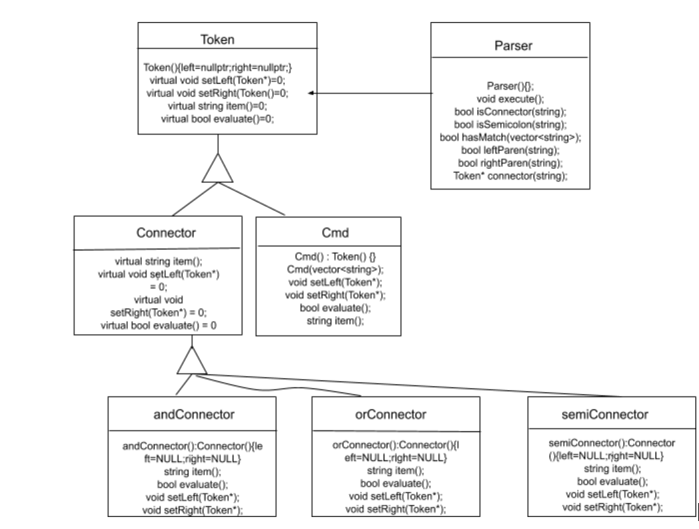

# CS 100 Programming Project
# Winter 2020
# Alex Chen (862086202)
# Taeho Yoo (862066993)

## INTRODUCTION:
In this assignment, we will be creating our own CLI shell called rshell using C++. It will be able to print a command prompt, read in a line of commands and connectors from standard input, execute the appropriate commands using fork, execvp, and waitpid, and it will repeat these until an exit command is executed. Our design pattern will mostly likely be consisted of subclasses, inheritance, and polymorphism with one parent class composing of different token classes as its children. The inputs will be ingested by the base class and sent to one of its subclasses to be taken care of.  

## OMT DIAGRAM:

 

## CLASSES:
Parent: basic things that all the children class will have like if command is run, if exit has been called. The input will go through this class first and be transformed based on the parsing. 

Child 1: Token Class
GrandChildren: AndToken, OrToken (&&, ||): Connector tokens that helps us determine if things should execute or not. Ex: For &&, first one has to execute in order for the second part to execute as well and vice versa. Otherwise it will just fail. 
-For ||, if first command executes, will end there. If the first command doesn’t execute it will try to execute the second command.

PassToken (;): This class will allow us to put in multiple commands in one line, while separating them. The next command executes regardless of the first. 

CommentToken(#): This class will make us skip anything after a # unless it needs to be printed in a “ “.

Child 2: Executor Class (Recommended in the Slides): Executable commands such as exit, echo, ls etc. Each command will represent a function that will be called based on the input. 

## PROTOTYPES/RESEARCH:
Commands:
fork():
In order to use the fork command, need #include <unistd.h> library. Fork makes clone of process currently in, allowing 2 of same processes to run at the same time. Good for when having two things running at the same time. Changing something in one process won’t affect the other one. Fork returns a pid_t, if 0, we are in child process, if positive # greater than 0, we are in the parent process. If PID is -1, it has failed, and make sure to error check. Most of the time use wait() system call on the parent process until the child process ends. 

execvp(): 
Also needs to #include <unistd.h>.  Execvp() takes in char*, and char* array. Command, and arguments to the command. Important to have a null at the end of array, showing that it has hit the end. Execvp will terminate the process, so lines after it won’t go through. Can use fork along with exec by calling exec inside a child process in order to print out lines of code after the exec is called. 

waitpid():
Syntax: pid_t waitpid(pid_t pid, int *status, int options);

It is used to wait for a process to finish. 

OPTIONAL BUT HELPFUL:
WIFEXITED(): 
-Will be a nonzero number if the child process ends normally: (return from main, or called exit function)
WEXITSTATUS(): 
-When WIFEXITED() is nonzero, WEXITSTATUS() evaluates to the low-order 8 bits of the status argument that the child passed to the exit() or _exit() function, or the value the child process returned from main().

## DEVELOPMENT AND TESTING ROADMAP:
First: Understanding fork, execvp, and waitpid and how they work together. Try to understand the optional but helpful system calls wifexited and wexitstatus as well.
Caleb: work on sys call prototype
Alex:Working on Parser prototype
Build Parent Class: Will have basic commands that both children will need
      [Parent Class Construction](https://github.com/cs100/assignment-acty/issues/2)
Child 1: Deal with commands and parsing the commands 
Child 2: Deals with executing commands
Alex dealing with child 1 tokens
      [Token Class Creation + Grandchildren tokens](https://github.com/cs100/assignment-acty/issues/3)

Caleb Dealing with child 2 functions 
      [Executioner Class Creation + Executioner/Command functions](https://github.com/cs100/assignment-acty/issues/1)
Both planning to Unit Test after each grandchild (Examples of grandchild: Andtoken, Ortoken etc)
      [Unit test for token class](https://github.com/cs100/assignment-acty/issues/5)  /
      [Unit test for executioner class](https://github.com/cs100/assignment-acty/issues/4)      
 
Help each other when needed

# Assignment 2

Using composite patterns to build the basic layout of rshell, we have created 3 classes for use (tokenizer, connectorToken, and executioner). By taking the userinput as a string, our tokenizer becomes a main pointer object as a pure virtual abstract class. Our connectorToken implements the stringify, evaluate, and parser pure virtuals in tokenizer. It utilizes the parser to tokenize and parse the user input into a vector of tokens. We then convert this vector into an array of char* and use the executioner class to execute the commands and arguments. If commands are invalid, we throw an error message and exit. 

The base class is Tokenizer. ConnectorToken class inherits from Tokenizer. Executioner is its own class. 

The boost library was used during the tokenizing process. 

# Assignment 3
For this assignment, we basically had to rebuild most of our old assignment 2. Building on top of the assignment 2 specs, we have included test command features for literal and symbolic. We also included precendence operators (paranthesis) to change the precedence of our executions. The tree was built after we utilized the shunting yard algorithm to manage precedence, putting it into postfix notation. For our parser, to test for parentheses or brackets, we implemeneted an algorithm that splits up parentheses and semicolons if connected to a command/argument. 

# Current Bug:
When we use the || connector, for some reason if there is an error, it prints twice. Will use time period in Assignment 4 to try to fix.

